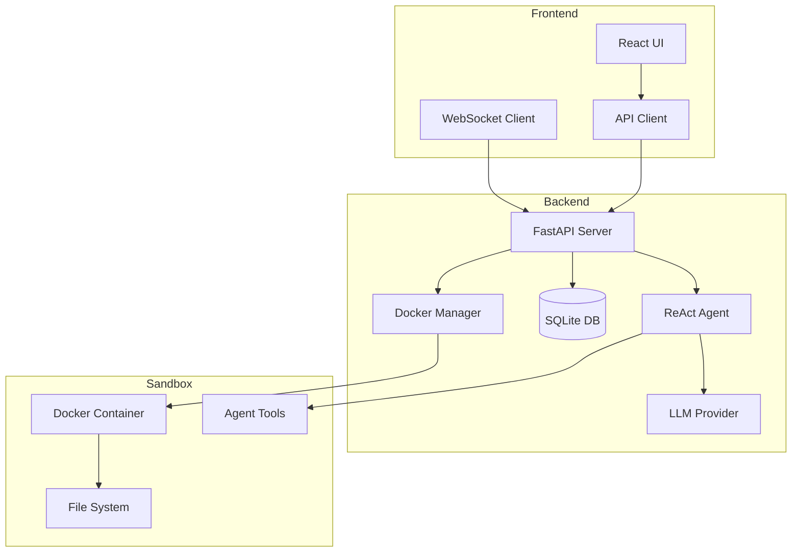

# 🤖 OpenCodex

<div align="center">

  **An AI-powered coding assistant that brings the power of multiple LLMs to your local development environment**

  [](https://www.python.org/downloads/)
  [](https://nodejs.org/)
  [](https://www.docker.com/)
  [](https://opensource.org/licenses/MIT)

  [Features](#-features) • [Quick Start](#-quick-start) • [Architecture](#-architecture) • [API](#-api-reference) • [Contributing](#-contributing)

</div>

## 📋 Table of Contents

- [Overview](#-overview)
- [Features](#-features)
- [Quick Start](#-quick-start)
- [System Requirements](#-system-requirements)
- [Installation](#-installation)
- [Configuration](#-configuration)
- [Usage](#-usage)
- [Architecture](#-architecture)
- [API Reference](#-api-reference)
- [Development](#-development)
- [Testing](#-testing)
- [Troubleshooting](#-troubleshooting)
- [Contributing](#-contributing)
- [License](#-license)

## 🌟 Overview

OpenCodex is a powerful, self-hosted AI coding assistant that provides a complete development environment with autonomous agent capabilities. Similar to Claude Projects or GitHub Copilot Workspace, but with full control over your data, choice of LLM providers, and execution environment.

### Why OpenCodex?

- **🔒 Privacy First**: Your code never leaves your infrastructure
- **🎯 Multi-LLM Support**: Use OpenAI, Anthropic, Google, or any LiteLLM-compatible provider
- **🚀 Autonomous Agents**: ReAct-based agents that can write, test, and debug code autonomously
- **📦 Sandboxed Execution**: Secure Docker containers for safe code execution
- **⚡ Real-time Streaming**: ChatGPT-like streaming with 33 updates/second
- **🎨 Production Ready**: Built with FastAPI, React, and TypeScript

## ✨ Features

### Core Capabilities

#### 🤖 **Autonomous AI Agents**
- **ReAct Pattern**: Reasoning and Acting loop for complex problem solving
- **Tool System**: File operations, bash commands, code search, and more
- **Agent Templates**: Pre-configured agents for specific tasks (Python dev, Node.js, Data Analysis, etc.)
- **Function Calling**: Native LLM function calling for precise tool execution

#### 🔐 **Secure Sandbox Environment**
- **Docker Integration**: Isolated containers for each project session
- **Multiple Environments**: Python 3.11/3.12, Node.js 20, custom Docker images
- **Resource Limits**: CPU, memory, and disk quotas per container
- **File System Isolation**: Secure file operations within sandbox

#### 💬 **Advanced Chat Interface**
- **Real-time Streaming**: WebSocket-based streaming with optimized batching (30ms intervals)
- **Virtualized Message List**: React-Virtuoso for handling thousands of messages
- **Rich Content Support**: Code highlighting, markdown, images, PDFs
- **Action Visualization**: See agent thoughts, tool calls, and results in real-time

#### 📁 **Project Management**
- **Project-based Workflow**: Organize work into separate projects with isolated environments
- **Session Management**: Multiple chat sessions per project with history
- **File Management**: Upload, download, and manage project files
- **Agent Configuration**: Per-project LLM and tool settings

#### 🎯 **Developer Experience**
- **API-First Design**: Complete REST API with OpenAPI documentation
- **WebSocket Support**: Real-time communication for streaming responses
- **Type Safety**: Full TypeScript support in frontend
- **Extensible Architecture**: Easy to add new tools and agents

## 🚀 Quick Start

### Prerequisites

- **Python** 3.11 or higher
- **Node.js** 18+ and npm
- **Docker** (for sandbox execution)
- **Git** (for version control)

### One-Line Install

```bash
# Clone and setup
git clone https://github.com/yourusername/open-codex-gui.git
cd open-codex-gui
./scripts/setup.sh  # Coming soon
```

### Manual Setup

#### 1. Backend Setup

```bash
cd backend

# Create virtual environment
python3 -m venv venv
source venv/bin/activate  # On Windows: venv\Scripts\activate

# Install dependencies
pip install -r requirements.txt

# Configure environment
cp .env.example .env
# Edit .env and add your API keys

# Start the server
python -m app.main
```

#### 2. Frontend Setup

```bash
cd frontend

# Install dependencies
npm install

# Start development server
npm run dev

# Or run with Electron (desktop app)
npm run electron:dev
```

#### 3. Access the Application

- **Web Interface**: http://localhost:5173
- **API Documentation**: http://localhost:8000/docs
- **Health Check**: http://localhost:8000/health

## 💻 System Requirements

### Minimum Requirements

- **OS**: Linux, macOS, or Windows with WSL2
- **RAM**: 4GB minimum, 8GB recommended
- **Storage**: 10GB free space
- **CPU**: 2 cores minimum, 4 cores recommended
- **Docker**: Version 20.10 or higher

### Recommended Setup

- **OS**: Ubuntu 22.04 LTS or macOS 13+
- **RAM**: 16GB or more
- **Storage**: 50GB+ SSD
- **CPU**: 8 cores or more
- **GPU**: Optional, for local LLM inference

## 📦 Installation

### Docker Installation (Recommended)

```bash
# Pull the pre-built image
docker pull opencodex/opencodex:latest

# Run with docker-compose
docker-compose up -d

# Access at http://localhost:3000
```

### From Source

See [Quick Start](#-quick-start) for manual installation steps.

### Using Poetry (Backend)

```bash
cd backend
poetry install
poetry run python -m app.main
```

## ⚙️ Configuration

### Environment Variables

Create a `.env` file in the backend directory:

```bash
# LLM Provider Keys (add the ones you need)
OPENAI_API_KEY=sk-...
ANTHROPIC_API_KEY=sk-ant-...
GOOGLE_API_KEY=...
GROQ_API_KEY=...

# Database
DATABASE_URL=sqlite+aiosqlite:///./data/open_codex.db

# Security
SECRET_KEY=your-secret-key-here
ENCRYPTION_KEY=your-32-byte-key-here

# CORS
CORS_ORIGINS=["http://localhost:5173","http://localhost:3000"]

# Docker
DOCKER_HOST=unix:///var/run/docker.sock
CONTAINER_PREFIX=opencodex
CONTAINER_NETWORK=opencodex-network

# Storage
STORAGE_TYPE=local  # or 's3', 'volume'
STORAGE_PATH=./data/storage
```

### Agent Configuration

Agents can be configured per project with:

- **LLM Provider**: OpenAI, Anthropic, Google, Groq, etc.
- **Model**: gpt-4o, claude-3-opus, gemini-pro, etc.
- **Temperature**: 0.0 - 1.0
- **Max Tokens**: Up to model limit
- **Tools**: Enable/disable specific tools
- **System Instructions**: Custom prompts

## 📖 Usage

### Creating a Project

1. Click "New Project" on the home screen
2. Enter project name and description
3. Select agent template (optional)
4. Configure LLM settings

### Starting a Chat Session

1. Open a project
2. Click "New Chat" or select existing session
3. Type your request or upload files
4. Watch the agent work autonomously

### Using Agent Tools

The agent has access to these tools:

- **`file_read`**: Read and visualize any file
- **`file_write`**: Create new files
- **`file_edit`**: Modify existing files
- **`bash`**: Execute shell commands
- **`search`**: Search code with regex patterns
- **`environment_setup`**: Configure Python/Node environments

### Example Prompts

```
"Create a Flask API with user authentication"
"Analyze this CSV file and create visualizations"
"Debug this React component and add tests"
"Refactor this code to use async/await"
```

## 🏗️ Architecture

### System Overview



### Technology Stack

#### Backend
- **Framework**: FastAPI 0.115+
- **Database**: SQLAlchemy + SQLite (async)
- **LLM Integration**: LiteLLM 1.80+
- **WebSocket**: Native FastAPI WebSocket
- **Container**: Docker SDK for Python
- **Validation**: Pydantic 2.12+

#### Frontend
- **Framework**: React 18.3 + TypeScript 5.7
- **Build Tool**: Vite 5.4
- **State Management**: Zustand 5.0
- **Data Fetching**: TanStack Query 5.62
- **UI Components**: Custom + React-Virtuoso
- **Markdown**: Streamdown 1.6 (optimized for streaming)
- **Desktop**: Electron 33 (optional)

## 📚 API Reference

### REST Endpoints

#### Projects
- `GET /api/v1/projects` - List all projects
- `POST /api/v1/projects` - Create project
- `GET /api/v1/projects/{id}` - Get project
- `PUT /api/v1/projects/{id}` - Update project
- `DELETE /api/v1/projects/{id}` - Delete project

#### Chat Sessions
- `GET /api/v1/projects/{id}/chat-sessions` - List sessions
- `POST /api/v1/projects/{id}/chat-sessions` - Create session
- `GET /api/v1/chats/{id}` - Get session
- `DELETE /api/v1/chats/{id}` - Delete session

#### Messages
- `GET /api/v1/chats/{id}/messages` - List messages
- `POST /api/v1/chats/{id}/messages` - Send message

#### Agent Actions
- `GET /api/v1/chats/{id}/agent-actions` - List actions
- `GET /api/v1/agent-actions/{id}` - Get action details

#### Sandbox
- `POST /api/v1/sandbox/{session_id}/start` - Start container
- `POST /api/v1/sandbox/{session_id}/stop` - Stop container
- `POST /api/v1/sandbox/{session_id}/execute` - Run command
- `GET /api/v1/sandbox/{session_id}/status` - Get status

#### Files
- `POST /api/v1/files/upload/{project_id}` - Upload files
- `GET /api/v1/files/project/{project_id}` - List files
- `GET /api/v1/files/{id}/download` - Download file
- `DELETE /api/v1/files/{id}` - Delete file

### WebSocket

```javascript
// Connect to chat stream
const ws = new WebSocket('ws://localhost:8000/api/v1/chats/{id}/stream');

// Send message
ws.send(JSON.stringify({
  type: 'message',
  content: 'Write a hello world program'
}));

// Receive events
ws.onmessage = (event) => {
  const data = JSON.parse(event.data);
  switch(data.type) {
    case 'start': // Stream started
    case 'chunk': // Text chunk
    case 'action': // Tool execution
    case 'observation': // Tool result
    case 'end': // Stream ended
    case 'error': // Error occurred
  }
};
```

## 🛠️ Development

### Project Structure

```
open-codex-gui/
├── backend/                 # FastAPI backend
│   ├── app/
│   │   ├── api/            # API routes & WebSocket
│   │   ├── core/           # Core modules
│   │   │   ├── agent/      # ReAct agent & tools
│   │   │   ├── llm/        # LLM provider
│   │   │   ├── sandbox/    # Docker management
│   │   │   └── storage/    # File storage
│   │   ├── models/         # Database models
│   │   └── main.py         # Application entry
│   ├── tests/              # Test suite
│   └── requirements.txt    # Dependencies
│
├── frontend/               # React frontend
│   ├── src/
│   │   ├── components/     # React components
│   │   ├── hooks/          # Custom hooks
│   │   ├── services/       # API clients
│   │   ├── stores/         # State management
│   │   └── App.tsx         # Main app
│   ├── electron/           # Electron wrapper
│   └── package.json        # Dependencies
│
├── docker/                 # Docker configs
├── scripts/                # Utility scripts
└── docs/                   # Documentation
```

### Adding a New Tool

1. Create tool class in `backend/app/core/agent/tools/`:

```python
from app.core.agent.tools.base import Tool, ToolResult

class MyTool(Tool):
    @property
    def name(self) -> str:
        return "my_tool"

    @property
    def description(self) -> str:
        return "Description of what this tool does"

    async def execute(self, **kwargs) -> ToolResult:
        # Tool implementation
        return ToolResult(success=True, output="Result")
```

2. Register in `ToolRegistry`
3. Add to agent templates if needed

### Adding a New Agent Template

Edit `backend/app/core/agent/templates.py`:

```python
"my_agent": AgentTemplate(
    id="my_agent",
    name="My Custom Agent",
    description="Specialized agent for...",
    system_instructions="...",
    enabled_tools=["file_read", "file_write", "bash"],
    llm_model="gpt-4o-mini",
    # ... other settings
)
```

## 🧪 Testing

### Backend Tests

```bash
cd backend

# Run all tests
pytest

# Run with coverage
pytest --cov=app --cov-report=html

# Run specific test
pytest tests/test_agent.py::TestReActAgent

# Run integration tests
pytest tests/integration/

# Run with markers
pytest -m "not slow"
```

### Frontend Tests

```bash
cd frontend

# Unit tests (coming soon)
npm run test

# E2E tests with Playwright
npm run test:e2e

# E2E with UI
npm run test:e2e:ui

# E2E debugging
npm run test:e2e:debug
```

### Performance Testing

```bash
# Backend load testing
locust -f tests/load/locustfile.py

# Frontend performance
npm run test:performance
```

## 🐛 Troubleshooting

### Common Issues

#### Backend Won't Start

```bash
# Check Python version
python --version  # Should be 3.11+

# Reinstall dependencies
pip install --upgrade -r requirements.txt

# Check database
rm backend/data/open_codex.db  # Reset database
```

#### Docker Issues

```bash
# Check Docker daemon
docker info

# Reset containers
docker ps -a | grep opencodex | awk '{print $1}' | xargs docker rm -f

# Check permissions
sudo usermod -aG docker $USER  # Linux only
```

#### WebSocket Connection Failed

- Check CORS settings in `.env`
- Ensure backend is running on correct port
- Check firewall/proxy settings

#### LLM API Errors

- Verify API keys in `.env`
- Check rate limits
- Ensure model names are correct

### Debug Mode

```bash
# Backend debug logging
LOG_LEVEL=DEBUG python -m app.main

# Frontend debug
npm run dev -- --debug
```

## 🤝 Contributing

We welcome contributions! Please see our [Contributing Guide](CONTRIBUTING.md) for details.

### Development Workflow

1. Fork the repository
2. Create a feature branch
3. Make your changes
4. Add tests
5. Run linters and tests
6. Submit a pull request

### Code Style

- **Python**: Black + Ruff
- **TypeScript**: ESLint + Prettier
- **Commits**: Conventional Commits

### Areas for Contribution

- 🔧 New agent tools
- 🎨 UI/UX improvements
- 🧪 Test coverage
- 📚 Documentation
- 🌐 Internationalization
- 🚀 Performance optimization

## 📄 License

This project is licensed under the MIT License - see the [LICENSE](LICENSE) file for details.

## 🙏 Acknowledgments

OpenCodex is inspired by and builds upon ideas from:

- [Claude Projects](https://claude.ai) - Project-based AI assistance
- [OpenHands](https://github.com/All-Hands-AI/OpenHands) - Open-source coding agents
- [Continue.dev](https://continue.dev) - IDE-based AI assistance
- [Aider](https://aider.chat) - Terminal-based pair programming
- [Gemini CLI](https://github.com/google-gemini/gemini-cli) - Terminal AI interface

## 📞 Support

- **Documentation**: [docs.opencodex.dev](https://docs.opencodex.dev)
- **Issues**: [GitHub Issues](https://github.com/yourusername/open-codex-gui/issues)
- **Discussions**: [GitHub Discussions](https://github.com/yourusername/open-codex-gui/discussions)
- **Discord**: [Join our community](https://discord.gg/opencodex)

---

<div align="center">

  **Built with ❤️ by the OpenCodex Team**

  Star ⭐ this repo if you find it useful!

</div>